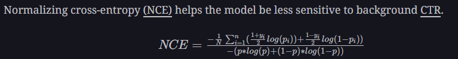

To check gpu utilisation

!watch -n1 nvidia-smi

𝗕𝗮𝘀𝗶𝗰𝘀
- Univariate statistics - mean, median, mode
- Standard deviation and variance
- Covariance and correlation
- Population and sample
- Nominal, ordinal and continuous, discrete data types
- Outlines
- The Simpson’s Paradox
- Selection Bias

𝗛𝘆𝗽𝗼𝘁𝗵𝗲𝘀𝗶𝘀 𝗧𝗲𝘀𝘁𝗶𝗻𝗴
- Hypothesis Statements
- Z-Test
- T-Test
- T-Test for sample means
- Z-Test for proportions
- Paired and unpaired T-Tests
- Variance test
- ANOVA
- Chi-Squared test
- Goodness of Fit test for categorical data
- Nominal, ordinal and continuous, discrete data types
- Pairwise tests
- T-Test assumptions
- Non-parametric tests
- Type 1 & 2 Errors

𝗣𝗿𝗼𝗯𝗮𝗯𝗶𝗹𝗶𝘁𝘆 & 𝗗𝗶𝘀𝘁𝗿𝗶𝗯𝘂𝘁𝗶𝗼𝗻𝘀
- The Bayes Theorem
- Conditional probability
- Normal distribution
- Uniform distribution
- Bernoulli distribution
- Binomial distribution
- Geometric distribution
- Poisson distribution
- Exponential distribution
- Deriving the mean and variance of distributions
- Central Limit Theorem
- The Birthday problem
- Card probability problems
- Die roll problems

𝗥𝗲𝗴𝗿𝗲𝘀𝘀𝗶𝗼𝗻 𝗠𝗼𝗱𝗲𝗹𝗶𝗻𝗴
- OLS regression
- Confidence vs prediction intervals
- Logistic regression
- Regression model assumptions
- Model diagnostic checks
- R-Square vs R-Square Adjusted
- AIC, BIC, CP Statistics
- Model Interpretation

# Large Scale Machine Learning (with MLOps)

For use cases in computer vision and NLP, features can be computed using a small number of data sources. However, for use cases with tabular data like fraud, recommender system, ETA, dynamic pricing, etc. features are computed from many sources,

## Data Support
1. Data Ingestion
- Streaming Ingestion: Click Stream (millions/sec)
  Clickstream is user interactions with some interface: Mobile App, Voice Assistant, Desktop
  Clickstream Tools (Pub/Sub): Kafka (Apache open source), Kinesis (AWS Managed)
  
  - install kafka
  - setup zookeeper setup (directory and port) and run the zookeeper server.
  - setup broker and run the broker server
  
  Note: while setting up you would also set topics
  
  setup a producer:
  - webapp with click stream
  - connect the falsk app with kafka broker
  - send the response from web app to kafka broker to specific topic in broker
  
  You can setup a consumer message that validates whether we are able to receive message from producer in terminal.
  
  Notes:
  I Clickstream
An ordered series of interactions that users have with some interface. In the traditional sense, this can be literal clicks of a mouse on a
desktop browser. Interactions can also come from touchscreens and conversational user interfaces.
| Change Data Capture
The process of recording changes In the data within a database system. For Instance, If a user cancels their Netflix subscription, then
the row In some table will change to indicate that they're no longer a subscriber.
The change In this row can be recorded and referenced later for analysis or audit purposes.
| Apache Kafka %
An open-source software platform which provides a way to handle real-time data streaming.
| Amazon Kinesis %
An AWS product that provides a way to handle real-time data streaming.

| Zookeeper %
Aservice designed to reliably coordinate distributed systems via naming service, configuration management, data synchronization,
leader election, message queuing, or notification systems.

| Database
Atool used to collect and organize data. Typically, database management systems allow users to Interact with the database.

I oLtp
Online transaction processing. A system that handles (near) real-time business processes. For example, a database that maintains a
table of the users subscribed to Netflix and which Is then used to enable successful log-ins would be considered OLTP. This is opposed
to OLAP.

I oLap
online analytical processing. A system that handles the analytical processes of a business, including reporting, auditing, and business
Intelligence. For example, this may be a Hadoop cluster which maintains user subscription history for Netflix. This is opposed to OLTP.

| Availability Zone (AZ)
Typically a single data center within a region which has two or more data centers. The term "multi-AZ" implies that an application or
software resource is present across more than one AZ within a reglon. This strategy allows the software resource to continue operating,
even if a data center becomes unavailable.
  
  
- Change Data Capture
- Live Video

2. Data Storage
configure hdfs sink through kafka
pass the address of name node or master node
then run the connector

you can see the name node and verify what are getting stored

Notes:
| Hard Disk Drive (HDD)
Astorage device which operates by setting bits on a spinning magnetic disk. The capacity and the read/write performance of the HDD
are the main characteristics to consider when using an HDD within a particular system.

| Data Replication
Astrategy used to mitigate the potential of data loss In the event of a system or component failure. In the most basic form, it involves
writing Identical data to more than one device or location. More efficient techniques like erasure coding incorporate mathematics to
recover lost data without referring to an explicit copy of the data

| Hadoop Distributed File System (HDFS)
An open-source Apache software product which provides a distributed storage framework.

I Avro
Arow-oriented data serializer provided by Apache.

| Parquet
A column-oriented data storage format provided by Apache.
| Exactly-once Semantics §
Guarantees that an object within a distributed system is processed exactly once. Other semantics include maybe, at-least-once, and at-
most-once §

3. Data Processing
SSH into name node of hdfs cluster
use AWS EMR to setup the processing cluster
Jupyter notebook outisde of spark cluster also can interact with it and submit jobs in cluster. The tool to do that is livy.
I Recommendation Carousel
A component within a graphical or conversational user interface which presents recommendations to a user. This can include
products, ads, and media content.
| Central Processing Unit (CPU)
A general purpose compute resource responsible for executing computer programs.
| Seasonality
The predictable changes of data throughout the calendar year.
I Parallelization
When two or more computer programs are executed at the same Instant across more than one processor.
| Random Access Memory (RAM)
A device on a computer which stores the data and machine code of a running computer program.
| Apache Spark
Asoftware interface which provides implicit parallelism and fault tolerance across a cluster of machines.
| Apache YARN
Asoftware product responsible for managing compute resources across a cluster of machines.
| Elastic MapReduce (EMR) %
An Amazon Web Services product which provides users access to a Hadoop cluster.
| Jupyter Notebook
A Project jupyter product which provides an interactive workspace to execute code.
4. Process Orchestration
The airflow dag defines how worker first ssh into name node of hadoop cluster. The worker trigger spark jobs.
So we can say airflow automates the data processing pipelines.
| Apache Airflow
Aworkflow management system that provides users a way to author, schedule, and execute software.

## Exploration
Our jupyter notebook should have access to hdfs and spark clusters for compute. So we have explored the data and its applications to models.
| Automated Machine Learning (Auto-ML)
A strategy which automates the process of applying features and labels to a machine learning model. |
| Data Governance
The method of managing, using, and protecting an organization's data. 

## Experimentation
Once we are satisfied on offline evaluations during exploration, we want online evaluations with real users.
1. Frequentist AB Testing
- A/B Testing
The process of providing two or more different experiences across two or more subgroups of a population. The goal is to measure the change in behavior of the subgroups upon receiving the respective experiences.

- A/ATest
An A/B test in which the experiences being tested are identical to one another. This is done in an effort to determine statistical validity of the A/B tool, the metric being monitored, and the analysis process being used.

- User Agent
An identifier used to describe the software application which a user is using to Interact with another software application. For instance,
an HTTP request to a website typically includes the user agent so that the website knows how to render the webpage.

- Session ID
A unique identifier assigned to a user to keep track of a user's connected interactions. For instance, a session may include a user logging In, purchasing an item, and logging out. Here, the session ID would be used to reference the group of those three Interactions.
This session ID can be stored in the user's Internet browser as a cookie.

- Cookie
A small piece of data stored by a browser which indicates stateful information for a particular website. For instance, a cookle can be
stored in your browser after you log in to a website to indicate that you are logged In. This will stop subsequent pages from asking you
to log In again.

Frequentist approach uses p-value and confidence interval
3. Bayesian AB Testing
Here we use prior knowledge.
The posterior and prior of same distribution initially.
In bayesian we sample from distribution and infer results with probability.
Beta Distribution
This distribution is used to model percentages and proportions such as click-through probabilities.
5. Multi Armed Bandit
| Multi-Armed Bandit (MAB)
A process which provides a number of choices |

7. Impact Estimation
THis is determine if experiment is worth is pre-experiment and whether to launch post-experimentation
3 Key Terms -
| Shadow Test 3
Running two or more versions of software In parallel while only surfacing the result of one of the experiences to the end user. Thisfs |
done in an effort to gauge the differences between the software versions. 1
| Sample Selection Bias
The bias that occurs when sampling a population into one or more subgroups at random results in a systematic inclusion or exclusion
of some data. §
| Experiment Collision |
The event where one experiment unintentionally influences the result of one or more separate experiments. §

## Large Scale Training
1. Basic Models (Random Forest, Boosted Trees, Matrix Factorization, Logistic Regression etc).
Read parquet files from HDFS Node and then run experiments.
| MLlib
Alibrary provided by Apache Spark which provides Spark clusters access to machine learning algorithms and refated utiities. MLIIb |
provides a Dataframe-based APl which Is unofficially referred to as Spark ML, §
~ provides a Dataframe-based APl which is unofficially referred to as Spark ML
2. Deep Learning Models
For distributed DL we will use PyTorch or Tensorflow....or some more advanced tools like Horovod by Uber
| Model Parallelism |
Amachine learning model training strategy used to maximize the utilization of compute resources (CPUs/GPUS) In which the model Is 3
distributed across two or more devices. 1
| Data Parallelism
Amachine learning model training strategy used to maximize the utilization of compute resources (CPUs/GPUS) In which the datais |
distributed across two or more devices §
| Graphics Processing Unit §
A specialized device that has many cores, allowing it to perform many operations at a time. §
GPUs are often used within deep learning to accelerate training of neural networks by taking advantage of their ability to perform 1
many parallel computations.
| Concurrency
When two or computer programs share a single processor.
3. Model Validation
Bayesian Optimization is good but it is not non-parallizable. In Bayesian Op, the prior keep changing with iterations.

## Productionization
This is the MLOps (Writing test to reduce error, versioning, tracking, environment syncronization etc)

## Hosting
1. Data Hosting
| In-memory Database 1
A database which relies either solely or primarily on the RAM of a computer.
| Distributed Cache %
A cache which s distributed across two or more machines
2. Model Hosting
I Numba
Ajust-in-time Python compller which resolves a subset of the python programming language down to machine code

Metrics
Lift, CTR

Offline metrics: Precision, Recall, Logloss, Ranking Loss

Online metrics: CTR, Watch Time, Conversion Rate

